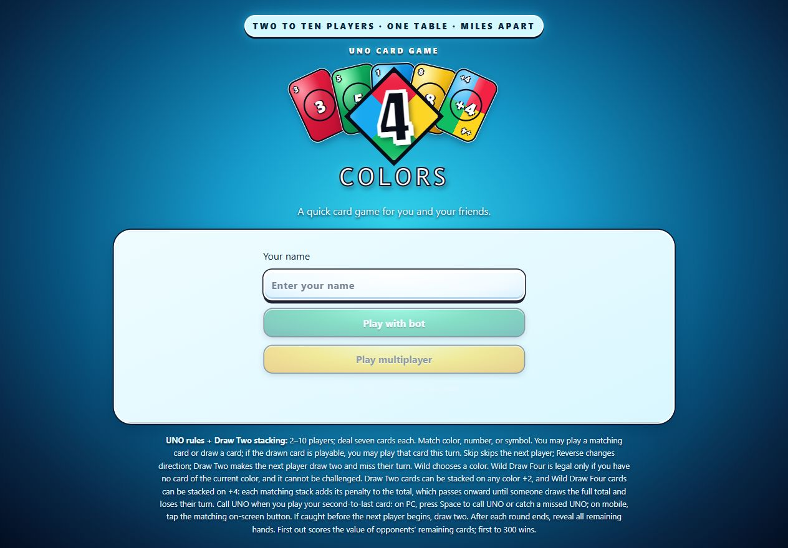
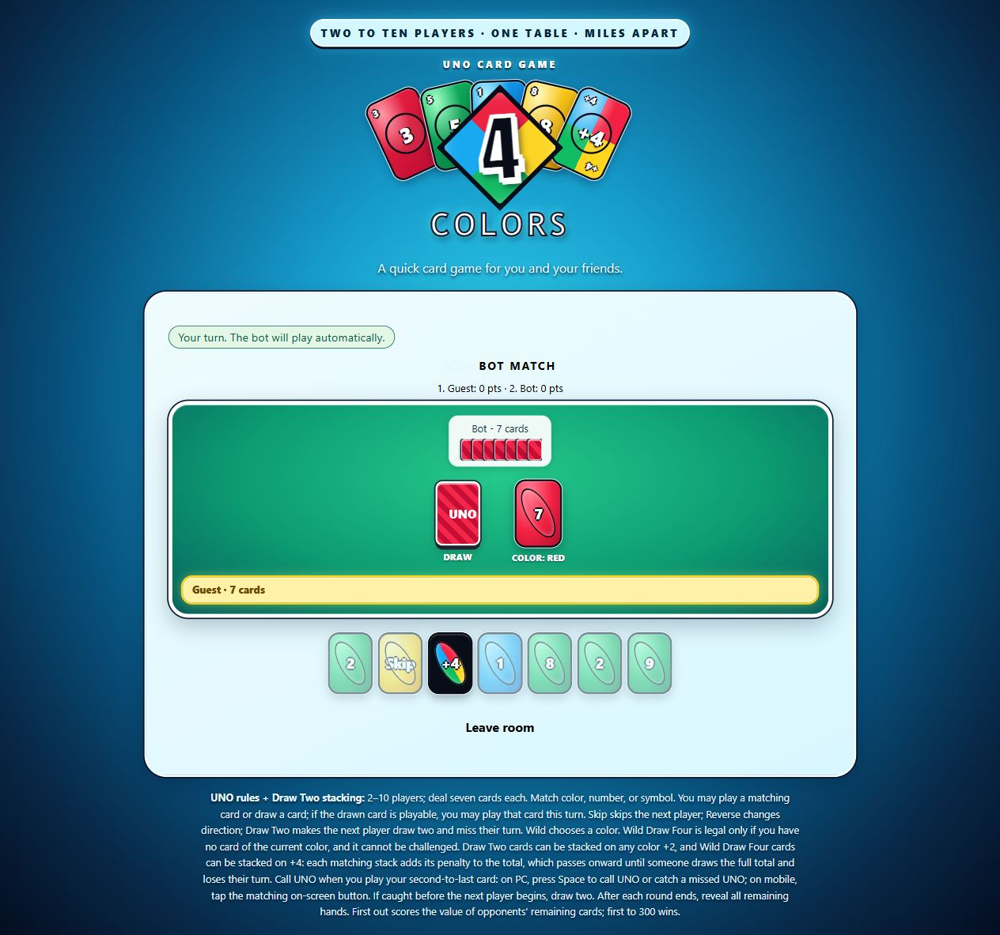

# UNO: play with a bot or friends

Enter a player name on the start screen before choosing either mode. The name is required and appears in the match.
## Screenshots

The start screen offers two modes:

- **Play with bot** starts a local match against an automated opponent.
- **Play multiplayer** lets a host create a room and share its invite link or six-character code. From 2 to 10 people can join before the host starts. Each person sees only their own hand.

Both modes use the same UNO deck and game flow: seven cards each; match by color, number, or symbol; draw and play a matching drawn card; Skip, Reverse, Draw Two, Wild, and Wild Draw Four without challenges; UNO calls and missed-call penalties; score cards left in opponents' hands toward 300 points. Opponents' hands are revealed when a round ends. This version uses stacking house rules for both Draw Two and Wild Draw Four: a player receiving +2 may stack a +2 of any color, and a player receiving +4 may stack another +4. Penalties accumulate and pass to the next player; a player without a matching stack draws the full total and loses their turn. On PC, Space calls UNO when your hand is down to one card or catches a missed UNO when that button is available. On mobile, tap the matching button.

## Publish it

1. Create a GitHub repository and add `index.html` to its root.
2. Open **Settings → Pages** in the repository.
3. Under **Build and deployment**, choose **Deploy from a branch**, select `main` and `/(root)`, then save.
4. Wait for GitHub Pages to publish and open the displayed URL.
5. Select **Play with bot** for a solo match, or **Play multiplayer** to create/join a room.

Other static hosts also work; there is no build step. Multiplayer uses PeerJS's public signaling service and direct WebRTC connections. Some restrictive NATs and firewalls require a TURN relay, which is not configured in this project. A guest who leaves the lobby frees their seat; if they leave during a match, an automatic player takes over their seat. The host page must stay open during a multiplayer match.

Rules are based on the classic [Mattel UNO instruction sheet](https://service.mattel.com/instruction_sheets/B0001-Eng.pdf).
